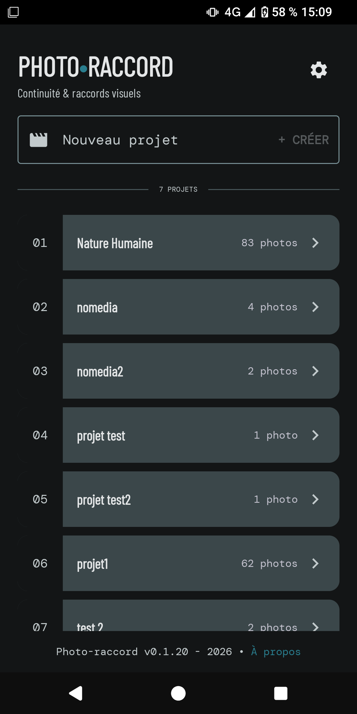
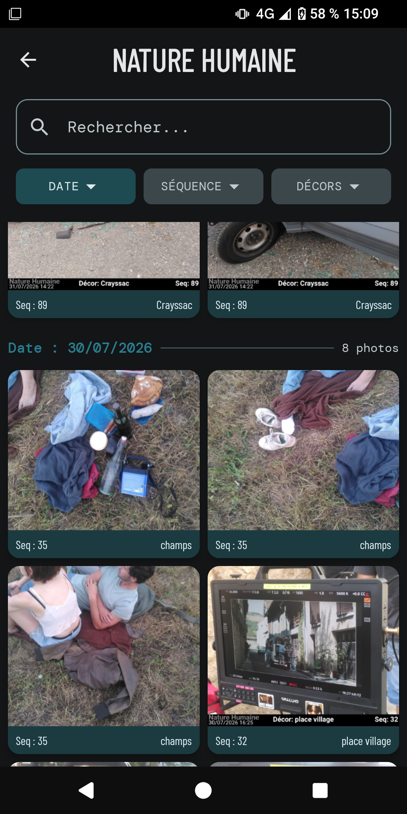

# Photoraccord

Photoraccord est une application Android conçue pour faciliter la prise et l'organisation de photos de raccord. Elle permet d'incruster directement les informations de la scène sur l'image et offre une gestion avancée du stockage local.

  
  

Vous pouvez trouver le fichier APK à installer ici : [PhotoRaccord V0.2.0](https://github.com/emmanuelborgetto-lgtm/Photo-raccord/releases/download/v0.2.0/photoraccord-v0.2.0.apk)

## Fonctionnalités principales

* **Incrustation automatique :** Ajout d'un bandeau informatif au bas des photos générées, contenant le nom du projet, la date, le décor et la séquence.
* **Gestion du stockage flexible :** Enregistrement des images dans le dossier par défaut (`DCIM/PhotoRaccord/[Projet]`) ou dans une arborescence personnalisée choisie par l'utilisateur via le Storage Access Framework (SAF).
* **Isolation des médias :** Option pour masquer les photos de raccord de la galerie principale de l'appareil (via la gestion automatisée de fichiers `.nomedia`).
* **Gestion de projets :** Base de données locale pour lister, renommer ou supprimer des projets.
* **Maintenance des données :** Outil de nettoyage intégré pour supprimer les références orphelines en base de données si les fichiers physiques ont été supprimés manuellement.
* **Personnalisation UI :** Plusieurs thèmes de couleurs disponibles (Ambre, Violet, Turquoise, Système).

## Architecture technique

* **Langage :** Kotlin
* **Interface Utilisateur :** Jetpack Compose
* **Caméra :** CameraX (avec redimensionnement dynamique des bitmaps en mémoire pour prévenir les `OutOfMemoryError`).
* **Base de données :** Room (Entités, DAO, requêtes asynchrones avec Kotlin Flow).
* **Concurrence :** Coroutines Kotlin (`Dispatchers.IO` / `Dispatchers.Main`).
* **Système de fichiers :** Utilisation conjointe de `MediaStore` et `DocumentFile` pour assurer la compatibilité avec le Scoped Storage d'Android 10+.

## Installation et Compilation

1. Cloner ce dépôt.
2. Ouvrir le projet avec Android Studio.
3. Synchroniser les dépendances Gradle.
4. Compiler et exécuter sur un appareil physique ou un émulateur.

## Licence

Ce projet est distribué sous licence GNU GPLv3. Voir le fichier [LICENSE](LICENSE) pour plus de détails.
